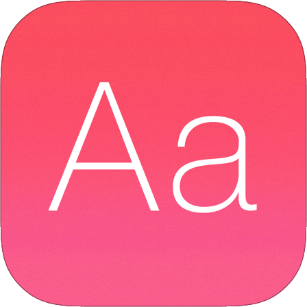

<h1> Dictionary App</h1>

The app is built using TypeScript and styled with SCSS to provide a seamless user experience and accurate information retrieval. 
It aims to assist language learners and users looking to expand their English vocabulary.

<br>

## Description

This dictionary app is designed to help users find meanings, examples, and synonyms for English words.
Users can enter an English word in the search bar, and the app will display the following information:

- **Pronunciation:** A button to listen to the pronunciation of the word.
- **Meaning:** The definition of the word in English.
- **Example:** Usage examples of the word in sentences.
- **Synonyms:** A list of synonyms for the word.

<br>


## Technologies Used

- TypeScript
- SCSS
- Fetch API


<br>

## Installation

To use a dictionary app, you'll typically need to follow these steps:

1. Download or clone the project from the GitHub repository:
   ```
   git clone https://github.com/eng-mohammad-mousa/Dictionary_App.git
   ```
2. Navigate to the project directory.

3. Open the `index.html` file in your preferred web browser. You can do this by double-clicking on the `index.html` file or right-clicking and selecting "Open With" your desired web browser.

Now you should be able to access word definitions and expand your English vocabulary by following these installation steps. Enjoy using the Dictionary App!

<br>

## Contributing

Contributions are welcome! If you have any ideas, suggestions, or bug reports, please open an issue on the GitHub repository.

